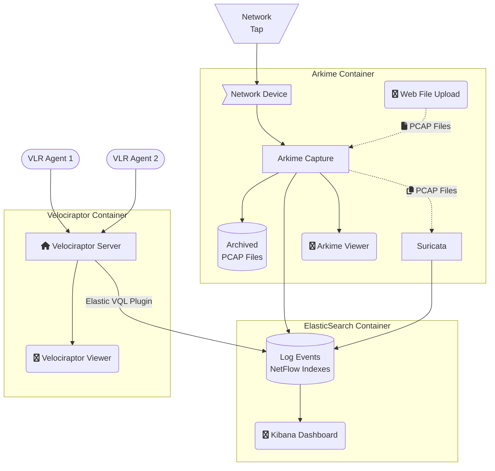

<!---
Copyright 2024 dah4k
SPDX-License-Identifier: MIT-0
-->

# Architecture of Arkime and Velociraptor

```mermaid
flowchart TD
    subgraph ElasticSearch Container
        ES[(Log Events\nNetFlow Indexes)]
        KIB_UI(fa:fa-firefox Kibana Dashboard)

        ES --> KIB_UI
    end

    %% Arkime standalone single container
    %% for processing low volume of network traffic.
    %% Suricata is embedded inside the same container.
    TAP[\Network\nTap/]
    TAP --> ARK_DEV
    subgraph Arkime Container
        ARK_DEV>Network Device]
        CAP[Arkime Capture]
        ARCHIVE[(Archived\nPCAP Files)]
        SUR[Suricata]
        ARK(fa:fa-firefox Arkime Viewer)
        UPL_UI(fa:fa-firefox Web File Upload)

        ARK_DEV --> CAP
        CAP --> ARCHIVE
        CAP --> ES
        CAP --> ARK
        CAP -.->|fa:fa-copy PCAP Files| SUR
        UPL_UI -.-> |fa:fa-file PCAP Files| CAP
        SUR --> ES
    end

    VLR_AGENT1([VLR Agent 1]) --> VLR
    VLR_AGENT2([VLR Agent 2]) --> VLR
    subgraph Velociraptor Container
        VLR[fa:fa-home Velociraptor Server]
        VLR_UI(fa:fa-firefox Velociraptor Viewer)

        VLR --> VLR_UI
        VLR -->|Elastic VQL Plugin| ES
    end
```
