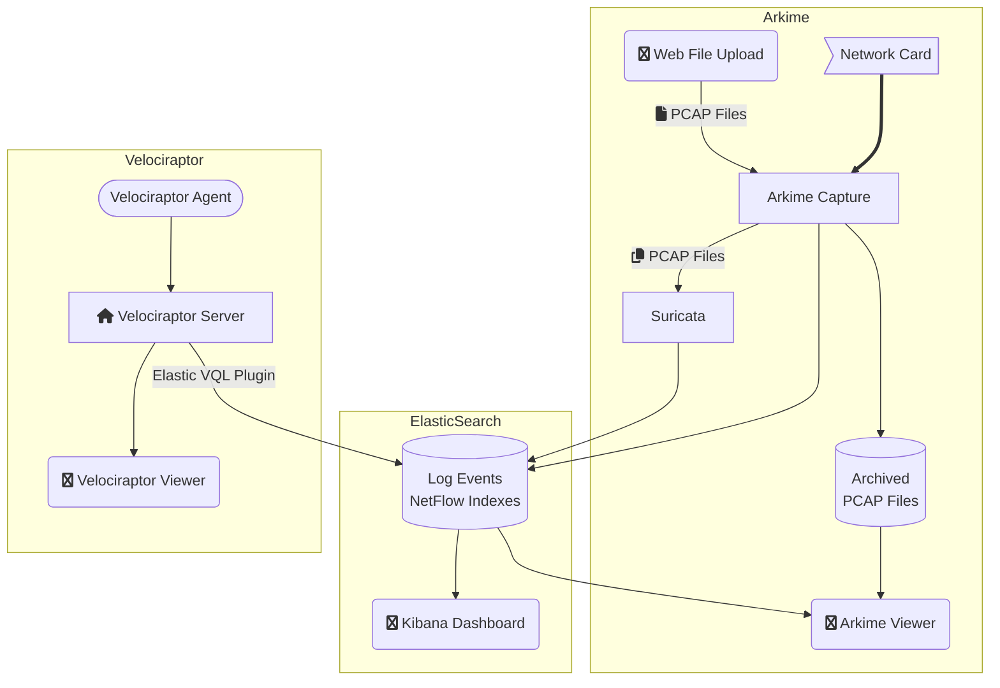

# Arkime and Velociraptor

```mermaid
flowchart TD
    subgraph ElasticSearch
        ES[(Log Events\nNetFlow Indexes)]
        KIB_UI(fa:fa-firefox Kibana Dashboard)

        ES --> KIB_UI
    end

    subgraph Arkime
        DEV>Network Card]
        CAP[Arkime Capture]
        ARCHIVE[(Archived\nPCAP Files)]
        SUR[Suricata]
        ARK(fa:fa-firefox Arkime Viewer)
        UPL_UI(fa:fa-firefox Web File Upload)

        DEV ==> CAP --> ES --> ARK
        CAP --> ARCHIVE --> ARK
        CAP -->|fa:fa-copy PCAP Files| SUR --> ES
        UPL_UI --> |fa:fa-file PCAP Files| CAP
    end

    subgraph Velociraptor
        VLR_C([Velociraptor Agent])
        VLR_S[fa:fa-home Velociraptor Server]
        VLR_UI(fa:fa-firefox Velociraptor Viewer)

        VLR_S --> VLR_UI
        VLR_C --> VLR_S -->|Elastic VQL Plugin| ES
    end
```
